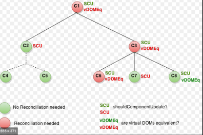
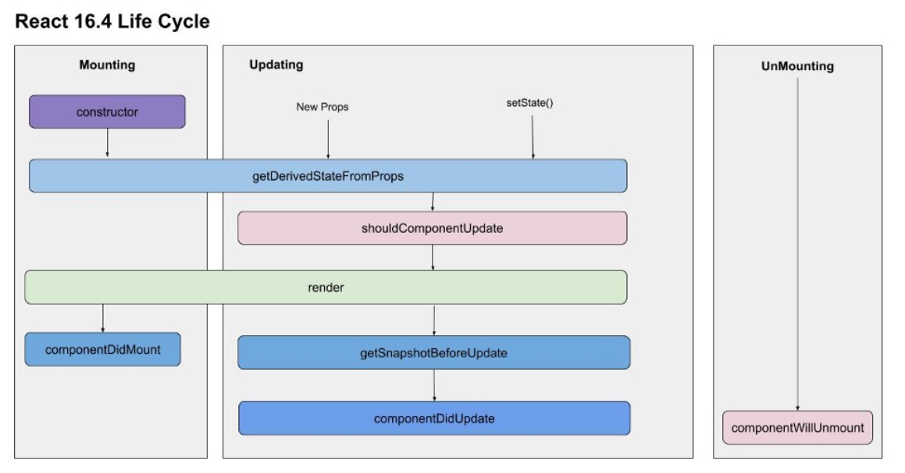

## 8. React

### 8.1 Базовый React

### 8.1.1 Зачем вообще нужен React ?

<details>
<summary>Ответ</summary>

Сегодня очень большим количеством сервисов пользуются через браузер.  
Интерфейс современных приложений должен быть более умным и отзывчивым (динамически менятся в зависимости от действий пользователя).  
Чтобы сделать это в браузере, нужно напрямую менять DOM.  
Основные причины почему это не ок:

- Менять DOM напрямую медленно (reflow, repainting);
- Когда мы меняем DOM чистым JSом, это императивный подход, и с ним сложнее работать чем с императивным;

```jsx
// imperative approach
const button = document.createElement("button");
button.textContent = "Greeting button";
button.addEventListener("click", () => "hello");

// declarative approach
<button onClick={() => "hello"}>Greeting button</button>;
```

React решает эти проблемы:

- React использует декларативный подход (который на этапе сборки транспилируется в императивный);
- Под капотом React минимизует обращения к DOM (Virtual DOM);
</details>

### 8.1.2 Почему React и ReactDOM в разных модулях ?

<details>
<summary>Ответ</summary>

В модуле `react` находится код для создания React-элементов (`React.createElement`).  
Через `react-dom` можно рендерить эти React-элементы в реальный DOM.

Причина разделения в том, что React-элементы созданные `react` можно рендерить не только в DOM браузера (`react-native`, `electron`).

</details>

### 8.1.3 Что такое Virtual DOM и как он работает ?

<details>
<summary>Ответ</summary>

Грубо говоря, Virtual DOM это обычный JS-объект.  
Перестраивать этот объект гораздо быстрее, чем перерендеривать реальный DOM.  
Поэтому когда нужно перерисовать интерфейс, React применяет **все изменения** к Virtual DOM и только **финальный результат** применяет к реальному DOM.  
То есть мехпнизм Virtual DOM минимизирует количество обращиний к реальному DOM.  
Кроме того, React по-максимуму старается минимизировать количество перерисовок (например, если у ноды DOM поменялся атрибут, React не будет перисовывать его, а просто перезапишет атрибут)

</details>

### 8.1.4 Что такое reconciliation и как оно работает ?

<details>
<summary>Ответ</summary>

Реконсиляция (согласование) - механизм сравнения Virtual DOM и реального DOM и применения минимальных изменений к реальному DOM.



Virtual DOM и реальный DOM - два дерева.  
Нужно найти разницу между ними.  
Передовые алгоритмы имеют сложность порядка O(n^3), где n - количество элементов в деревьях (слишком медленно).  
Чтобы ускорить алгоритм сравнения деревьев используются две эвристики:

- Два элемента с разными типами произведут разные деревья (то есть если React видит, что `div` поменялся на `article`, он дальше не проверяет, что увеличивает скорость сравнения).
- Разработчик может указать, какие дочерние элементы могут оставаться стабильными между разными рендерами с помощью пропа `key`.

</details>

### 8.1.5 Зачем нужен атрибут key ?

<details>
<summary>Ответ</summary>

```jsx
// изначально есть список
<ul>
  <li>1</li>
  <li>2</li>
  <li>3</li>
</ul>

// что-то поменялось и список перерисовался
<ul>
  <li>4</li>
  <li>1</li>
  <li>2</li>
  <li>3</li>
</ul>

```

React сравнивает первый элемент первоначально списка с первым элементом получившегося списка, второй со вторым и т.д.  
При каждом сравнении есть несовпадение.  
Реакт полностью перерисовывает список, хотя можно было бы просто добавить новую ноду в начало списка.

Тут помогают key:

```jsx
// изначально есть список
<ul>
  <li key="67f823f42f2">1</li>
  <li key="12d321as211">2</li>
  <li key="jk2131434f1">3</li>
</ul>

// что-то поменялось и список перерисовался
<ul>
  <li key="new-key-aye">4</li>
  <li key="67f823f42f2">1</li>
  <li key="12d321as211">2</li>
  <li key="jk2131434f1">3</li>
</ul>

```

В этом случае React сравнивает не первый с первым, а по ключам, и в результате понимает, что в новом списке просто добавилась нода сверху.

Для ключей лучше использовать id элементов, которые мы отрисовываем.  
Для ключей не имеет смысла генерировать новое значение на каждом рендере (`<li key={createHash()}></li>`) или использовать что-то типа `Date.now()` или `Math.rand()`

</details>

### 8.1.6 Когда можно использовать index для key ?

<details>
<summary>Ответ</summary>

Если точно известно, что порядок элементов не будет меняться.

</details>

### 8.1.7 Опиши жизненный цикл React-компонента

<details>
<summary>Ответ</summary>

Старый жизненный цикл:


Новый жизненный цикл:


Есть еще два ЖЦ-метода:

- `static getDerivedStateFromError` - используем для рендеринга запасного UI;
- `componentDidCatch` - используем для логирования ошибок;

Если компонент имплементирует один из этих методов, то он является `Error boundary`.

</details>

### 8.1.8 Где делать сайд-эффекты (запросы за данными / читать из localStorage) ?

<details>
<summary>Ответ</summary>

В `componentDidMount` (классовый компонент) или в `useEffect` (хуки).

</details>

### 8.1.9 Что такое `Error boundary` ?

<details>
<summary>Ответ</summary>

```jsx
import React from "react";

class ErrorBoundary extends React.Component {
  constructor(props) {
    super(props);

    this.state = { hasError: false };
  }

  static getDerivedStateFromError(error) {
    // Обновить состояние с тем, чтобы следующий рендер показал запасной UI.
    return { hasError: true };
  }

  componentDidCatch(error, errorInfo) {
    // Можно также сохранить информацию об ошибке в соответствующую службу журнала ошибок
    logErrorToMyService(error, errorInfo);
  }

  render() {
    if (this.state.hasError) {
      // Можно отрендерить запасной UI произвольного вида
      return <h1>Что-то пошло не так.</h1>;
    }

    return this.props.children;
  }
}
```

`ErrorBoundary` оборачивает компонеты.  
`ErrorBoundary` ловит исключения, которые выбрасывают его дочерние компоненты.

</details>

### 8.1.10 Что такое `React.lazy` ?

<details>
<summary>Ответ</summary>

Webpack собирает все .js, .jsx в один файл - бандл.  
Если этих файлов слишком много / они большие, бандл тоже получится большой.  
Если бандл будет большим, index.html будет долго его загружать.  
В таких ситуациях можно разбить один большой бандл на несколько кусков поменьше.  
Для этого используются динамические импорт:

```js
function getComponent() {
  const element = document.createElement("div");

  return import("lodash") // import() возвращает промис
    .then(({ default: _ }) => {
      const element = document.createElement("div");
      element.innerHTML = _.join(["Hello", "webpack"], " ");
      return element;
    })
    .catch((error) => "An error occurred while loading the component");
}

getComponent().then((component) => {
  document.body.appendChild(component);
});
```

Ну а в React можно динамически подгружать компоненты (но немного другой синтаксис):

```jsx
import React from "react";

// React.lazy используется именно для динамической подгрузки компонентов
const SomeComponent = React.lazy(() => import("@components/some-component"));

function App() {
  return (
    <React.Suspense fallback={<p>Loading...</p>}>
      <SomeComponent />
    </React.Suspense>
  );
}
```

Динамически подгружаемые компоненты нужно оборачивать в `<React.Suspense>`.  
Пока `<SomeComponent />` не загрузится, будет показано то, что в `fallback`.

</details>

### 8.1.11 Почему `componentWillMount`, `componentWillReceiveProps`и`componentWillUpdate` убрали из React ?

<details>
<summary>Ответ</summary>

Во-первых, эти методы часто неправильно использовали (делали асинхронные запросы в `componentWillMount`, записывали пропсы в стейт в `componentWillReceiveProps` и т.д).

Во-вторых, сейчас команда React работают над асинхронным рендерингом и конкурентным режимом.

```jsx
import React from "react";

const resource = fetchProfileData();

function ProfileDetails() {
  // Пробуем прочитать информацию о пользователе, хотя она может быть ещё не загружена
  const user = resource.user.read();
  return <h1>{user.name}</h1>;
}

function ProfileTimeline() {
  // Пробуем прочитать сообщения, хотя они могут быть ещё не загружены
  const posts = resource.posts.read();
  return (
    <ul>
      {posts.map((post) => (
        <li key={post.id}>{post.text}</li>
      ))}
    </ul>
  );
}

function ProfilePage() {
  return (
    <Suspense fallback={<h1>Loading profile...</h1>}>
      <ProfileDetails />
      <Suspense fallback={<h1>Loading posts...</h1>}>
        <ProfileTimeline />
      </Suspense>
    </Suspense>
  );
}
```

Несмотря на то, что для компонентов `ProfileTimeline` и `ProfileTimeline` еще не пришли данные и их нельзя рендерить, у них вызываются методы ЖЦ, которые можно вызывать (`constructor`, `componentWillMount` и т.д.).  
Например мы делаем `setInterval` в `componentWillMount` компонента `ProfileTimeline`.  
Предположим, что было выброшено исключение при загрузке данных (`resource.posts.read()`).  
Тогда нас выбросит в ближайший `ErrorBoundary` для `ProfileTimeline` (если `ErrorBoundary` есть).  
Но самое главное, что `setInterval` из `componentWillMount` компонента `ProfileTimeline` никуда не пропадет и **будет утечка памяти**.  
То есть можно сказать, что **прерывающая обработка ошибок в React может привести к утечкам памяти**.  
Это одна из причин депрекейта методов `componentWillMount`, `componentWillReceiveProps` и `componentWillUpdate`.

</details>

### 8.1.12 Расскажи про `shouldComponenUpdate`

<details>
<summary>Ответ</summary>

```jsx
import React from "react";

class SomeComponent extends React.Component {
  /**
   *
   * @param {object} nextProps - пропсы перед обновлением компонента
   * @param {object} nextState - стейт перед обновлением компонента
   * @returns {boolean} - нужно ли обновлять компонент
   *
   **/
  shouldComponentUpdate(nextProps, nextState) {}
}
```

</details>

### 8.1.13 Что такое `PureComponent` ?

<details>
<summary>Ответ</summary>

Это компонент с переопределенным методом `shouldComponenUpdate`: выполняет shallow comparsion пропсов и стейта и возвращает результат в булевом формате.

</details>

### 8.1.14 В чем разница между `props` и `state` ?

<details>
<summary>Ответ</summary>

- `props` приходят в компонент извне, а `state` - это внутреннее состояние компонета;
- `props` нельзя менять, а `state` можно;

</details>

### 8.1.15 Как поменять `state` ?

<details>
<summary>Ответ</summary>

Только через `this.setState` (классовый компонент) или через сеттер (хуки).

</details>

### 8.1.16 Что такое `PropTypes` ?

<details>
<summary>Ответ</summary>

`PropTypes` - модуль для описания типов пропсов.

```jsx
import React from "react";
import PropTypes from "prop-types";

function SomeComponent(props) {
  // ...
}

SomeComponent.propTypes = {
  isActive: PropTypes.bool.isRequired,
};
```

или

```jsx
import React from "react";
import PropTypes from "prop-types";

class SomeComponent extends React.Component {
  // ...

  static propTypes = {
    isActive: PropTypes.bool.isRequired,
  };

  // ...
}
```

- при несовпадении пропсов падает ошибка (даже во время выполнения приложения);
- не работают в production сборке (перфоманс);

</details>

### 8.1.17 Что такое `defaultProps` ?

<details>
<summary>Ответ</summary>

`defaultProps` - дефолтные значения пропсов.

```jsx
import React from "react";

function SomeComponent(props) {
  // ...
}

SomeComponent.defaultProps = {
  isActive: false,
};
```

или

```jsx
import React from "react";

class SomeComponent extends React.Component {
  // ...

  static defaultProps = {
    isActive: false,
  };

  // ...
}
```

</details>

### 8.1.18 `PropTypes` vs `TypeScript` ?

<details>
<summary>Ответ</summary>

`PropTypes` работают во время выполнения приложения, а `TypeScript` только при статическом анализе кода.

</details>

### 8.1.19 Что такое HOC ?

<details>
<summary>Ответ</summary>

HOC - high order component. Обертка вокруг изначального компонента.  
Используется для реиспользования логики.

</details>

### 8.1.20 React portal ?

<details>
<summary>Ответ</summary>

</details>

### 8.1.21 `SyntheticEvent` ?

<details>
<summary>Ответ</summary>

</details>

### 8.1.22 `Context` ?

<details>
<summary>Ответ</summary>

</details>

### 8.1.23 `Context` vs `useReducer` vs `Redux` ?

<details>
<summary>Ответ</summary>

</details>

---

## 8.2 Хуки

### 8.2.1 Зачем вообще нужны хуки ?

<details>
<summary>Ответ</summary>

</details>

### 8.2.2 `useState` ?

<details>
<summary>Ответ</summary>

</details>

### 8.2.3 Когда в `useState` нужно передавать коллбэк ?

<details>
<summary>Ответ</summary>

</details>

### 8.2.4 `useEffect` ?

<details>
<summary>Ответ</summary>

</details>

### 8.2.5 `useEffectLayout` ?

<details>
<summary>Ответ</summary>

</details>

### 8.2.6 `useReducer` ?

<details>
<summary>Ответ</summary>

</details>

### 8.2.6 `useReducer` vs `Redux` ?

<details>
<summary>Ответ</summary>

</details>

### 8.2.8 `useRef` ?

<details>
<summary>Ответ</summary>

</details>

### 8.2.9 `useContext` ?

<details>
<summary>Ответ</summary>

</details>

### 8.2.10 `useCallback` ?

<details>
<summary>Ответ</summary>

</details>

### 8.2.11 `useMemo` ?

<details>
<summary>Ответ</summary>

</details>

---

## 8.3 `React Router`

### 8.3.1 Что такое `React Router` ?

<details>
<summary>Ответ</summary>

</details>

### 8.3.2 Какие основные компоненты есть у `React Router` ?

<details>
<summary>Ответ</summary>

Роутеры:

- `<BrowserRouter />`;
- `<HashRouter />`;
- ..

Матчеры:

- `<Switch />`;
- `<Route />`;
- `<Redirect />`;

Ссылки:

- `<Link />`;
- `<NavLink />`;

[Тут подробнее](https://reactrouter.com/web/guides/primary-components).

</details>

### 8.3.3 `<Link />` vs `<NavLink />` ?

<details>
<summary>Ответ</summary>

</details>

### 8.3.4 Как программно можно влиять на роут ?

<details>
<summary>Ответ</summary>

</details>

### 8.3.5 `withRouter` ?

<details>
<summary>Ответ</summary>

</details>

### 8.3.6 Какие хуки есть у `React Router` ?

<details>
<summary>Ответ</summary>

</details>
